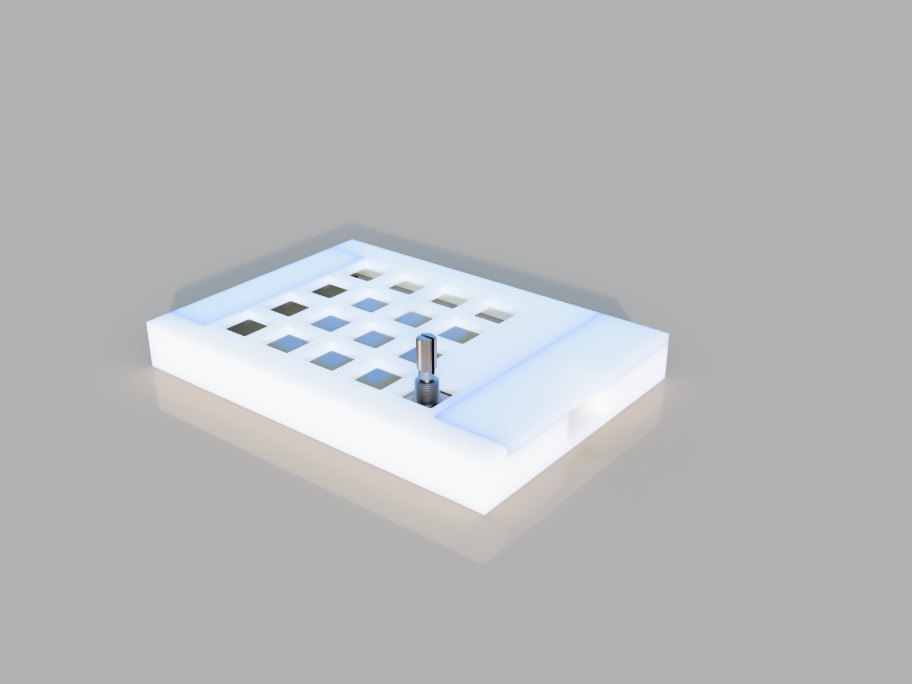
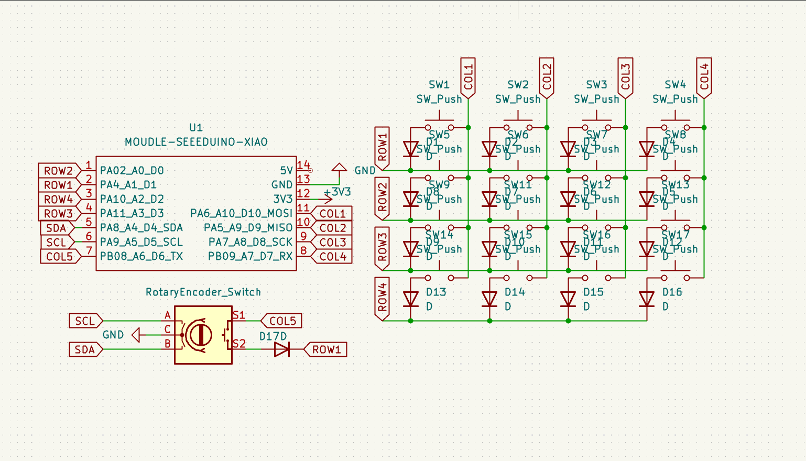
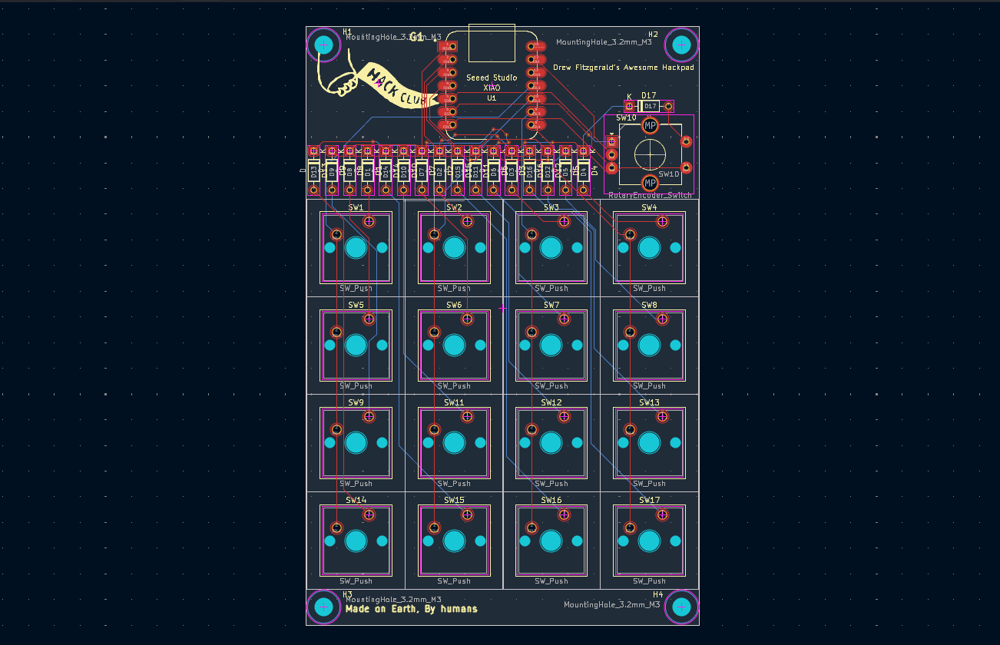
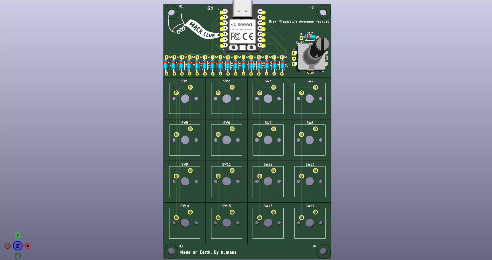

## Dinopad
Dinopad, is a small 16 key macropad, which features a diode matrix and a rotary encoder. The PCB is littered with dinosaurs, that's why it's called Dinopad.

## Case

## Schematic

## PCB

## 3D model

